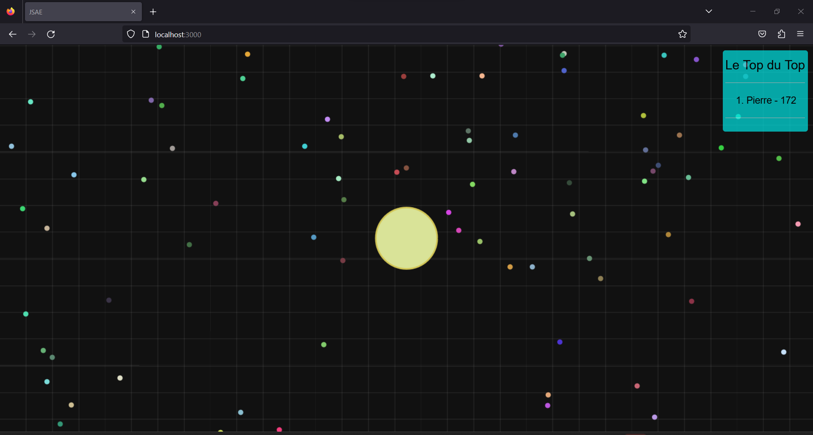

# JSAE 
# Nom 
* Noé Decobecq 
* Pierre Goujet
* Théo Franos 
* Groupe : S4-H




# Dépendances
* NodeJS
* ExpressJS
* Socket.io
* BootStrap
* JQuery

# Instructions
1. Faire un git clone de ce répertoire
2. ```cd``` dans ce fichier puis faire ```npm i```
3. Faire la commande```node index.js```
4. Allez sur localhost:3000 pour jouer.
5. Pour voir le multijoueur, il suffit d'ouvrir un autre onglet de votre navigateur et d'aller sur la même adresse. 


La taille de la carte est modifiable assez facilement. Vous pouvez éditer ceci dans le fichier ```socketMain.js``` contenu dans le fichier  ```sockets```. En haut de se fichier, il y a ```settings``` qui permet de modifier les paramètres de votre jeu de base:

``` 
let settings = {
  defaultOrbs: 50,
  defaultSpeed: 5,
  defaultSize: 6,
  defaultZoom: 1.5,
  worldWidth: 500,
  worldHeight: 500
}
```
Ce sont les meilleures paramètres pour tester notre projet avec le multijoueur.
Changez ```worldWidth``` et ```worldHeight``` (5000 x 5000 par exemple ) pour une plus grande carte.
